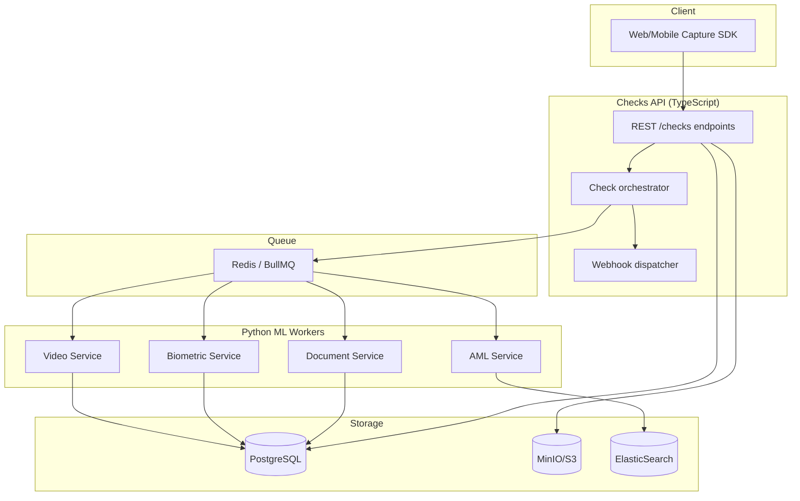
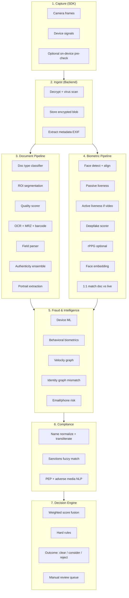
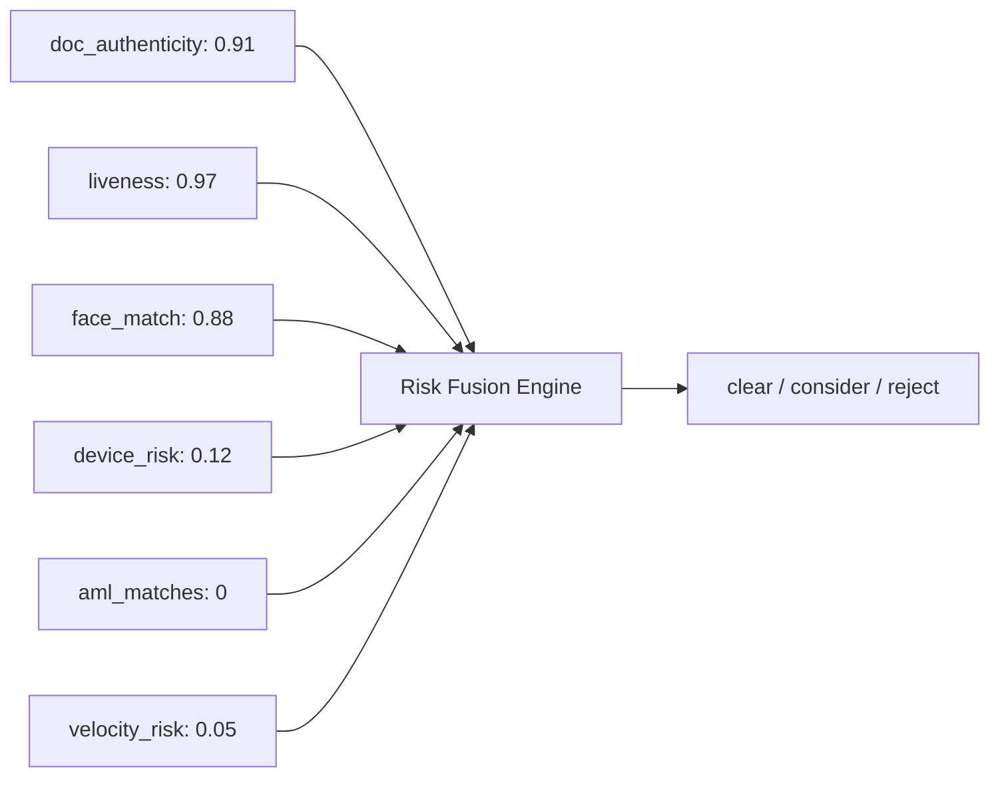
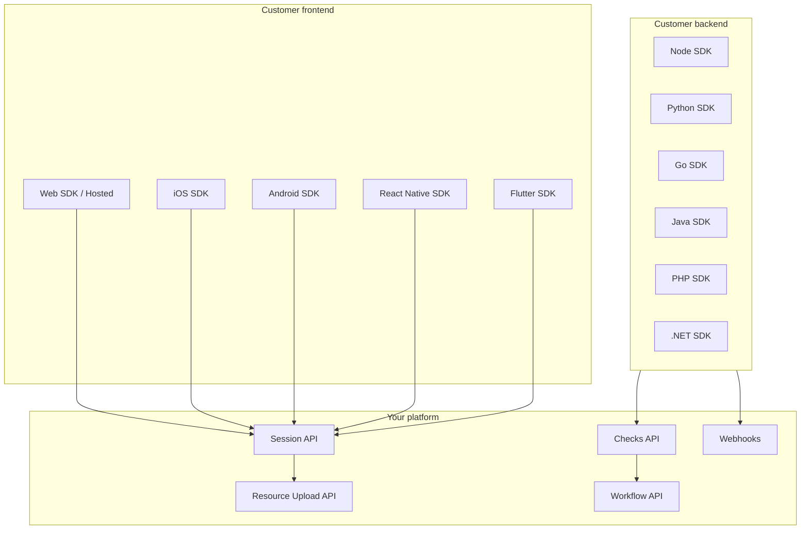

# Liveness Platform — Complete Technical Guide

**Version 1.0 · July 2026**

---

## Executive Summary

This guide is the full blueprint for building **Liveness** — a self-hosted identity verification and compliance platform comparable to ComplyCube, Onfido, or Persona. You own the stack: capture SDKs, Checks API, ML workers, and data.

**What you are building:** An orchestration platform that combines document OCR, biometric liveness, face matching, AML screening, and fraud signals into asynchronous **Checks** (`pending` → `complete` / `failed`) with webhooks.

**Core insight:** Production KYC is not one AI model. It is **25–40 specialized models** plus rules, fused into a risk decision. Vendors hide ensemble depth, country-specific document templates, and production retraining loops — not a single secret algorithm.

**Recommended stack:**

| Layer | Technology |
|-------|------------|
| Checks API | TypeScript (Fastify) + PostgreSQL + Redis |
| ML workers | Python (FastAPI) + ONNX / PaddleOCR / InsightFace |
| Storage | MinIO/S3 (documents), ElasticSearch (AML) |
| Capture | React Web SDK → iOS/Android native → RN/Flutter wrappers |

**MVP scope (8–12 weeks):** `document_check` + `identity_check` using PaddleOCR, OmniMRZ, MiniFASNet liveness, ArcFace face match, and yente AML.

**What requires licensed data (build adapters only):** SSN check, credit bureau, national eID gateways.

---

## Table of Contents

| Chapter | Topic |
|---------|-------|
| **1** | Platform overview & architecture |
| **2** | Technology stack & infrastructure |
| **3** | Checks API, database & security |
| **4** | Check types reference (all 16 checks) |
| **5** | Machine learning — complete pipeline |
| **6** | AI models — implementation reference |
| **7** | SDKs — Web, mobile & server libraries |
| **8** | Backend services & integration |
| **9** | Data, training & model operations |
| **10** | Build roadmap & realistic expectations |

---

# Chapter 1 — Platform Overview & Architecture

## 1.1. What You Are Actually Building

ComplyCube, Onfido, Persona, and Jumio are **orchestration platforms**. They do not run one magic model — they combine:

| Layer | Role |
|-------|------|
| **Capture** | Web/mobile SDK to collect document photos, selfies, live video |
| **AI workers** | OCR, liveness, face match, tamper detection, deepfake detection |
| **Data providers** | Sanctions lists, credit bureaus, government eID, phone/email reputation |
| **Workflow engine** | Async checks, status transitions, webhooks, manual review queue |
| **Compliance store** | Encrypted PII vault, audit logs, consent records, retention policies |

Your goal: **own the platform + AI pipeline**, and plug in external data only where building in-house is impossible (SSN, bureau credit, national eID gateways).

---

## 1.2. Recommended Tech Stack (Languages & Why)

### Core rule
Use **Python for AI/ML**, **TypeScript or Go for APIs**, **PostgreSQL for state**, **Redis for job queues**.

### Backend API — **TypeScript (Node.js) or Go**

| Choice | Why |
|--------|-----|
| **TypeScript + Fastify/NestJS** | Best DX for REST + webhooks + SDK generation; huge ecosystem for fintech; easy OpenAPI docs like ComplyCube |
| **Go** | If you need extreme throughput (millions of checks/day) and simple deployment; good for AML matching microservice |

**Recommendation:** Start with **TypeScript (Fastify)** for the Checks API. Add **Go** later for AML screening if latency becomes critical.

### AI / Vision Workers — **Python**

| Why Python |
|------------|
| Every serious CV model (InsightFace, PaddleOCR, MiniFAS, deepfake detectors) ships in Python/PyTorch/ONNX |
| FastAPI is ideal for internal ML microservices |
| Easy GPU deployment with Docker + CUDA |

**Recommendation:** **FastAPI** services behind a message queue, one service per domain:

- `doc-service` — document OCR + MRZ + tamper hints
- `bio-service` — liveness + face match + age estimation
- `video-service` — active liveness + deepfake scoring

### Frontend Capture UI — **TypeScript (React/Next.js)**

- WebRTC for camera capture
- TensorFlow.js or WASM ONNX for **on-device** passive liveness (optional, reduces server cost)
- Mobile later: **React Native** or native Swift/Kotlin SDKs

> **Full SDK matrix (Web, iOS, Android, React Native, Flutter, server libraries):** see Chapter 7 — SDKs

### Infrastructure

```
PostgreSQL     → clients, checks, documents, results, audit
Redis          → job queue (BullMQ) + rate limits
MinIO / S3     → encrypted document blobs (never store raw PII on local disk)
ElasticSearch  → AML entity index (via yente) OR OpenSearch
Docker         → every service containerized from day 1
```

---

## 1.3. System Architecture



### Async check flow (matches ComplyCube model)

1. `POST /clients` — create end-user
2. `POST /documents` — upload ID scan → returns `documentId`
3. `POST /livePhotos` or `POST /liveVideos` — upload selfie/video
4. `POST /checks` — `{ type: "identity_check", documentId, livePhotoId }`
5. Check status: `pending` → worker runs → `complete` or `failed`
6. Webhook fires to your customer's URL with `result` payload

---

## 1.4. Check Types — Build vs Buy

| Check type | Can you build it yourself? | How |
|------------|---------------------------|-----|
| **document_check** | ✅ Yes (80%) | PaddleOCR + MRZ parser + template validation |
| **identity_check** | ✅ Yes | Doc face crop + selfie + liveness + ArcFace match |
| **enhanced_identity_check** | ⚠️ Partial | Above + video liveness + deepfake model |
| **face_authentication_check** | ✅ Yes | Liveness + 1:1 face match vs enrolled photo |
| **age_estimation_check** | ✅ Yes | Face age model (InsightFace / dedicated age net) |
| **proof_of_address_check** | ⚠️ Partial | OCR utility bill + name/address fuzzy match |
| **driving_license_check** | ⚠️ Partial | OCR + PDF417 barcode (US/EU) + template rules |
| **standard_screening_check** | ✅ Yes | OpenSanctions / OFAC via yente or moov watchman |
| **extensive_screening_check** | ⚠️ Partial | Above + adverse media (needs news API or NLP pipeline) |
| **device_intelligence_check** | ✅ Yes | FingerprintJS-style signals + IP/VPN/proxy DB |
| **email_intelligence_check** | ⚠️ Partial | DNS/MX, disposable email lists, breach lookup APIs |
| **mobile_intelligence_check** | ❌ Hard | HLR/carrier lookup requires telecom data providers |
| **multi_bureau_check** | ❌ Very hard | Needs Experian/Equifax/TransUnion partnerships |
| **eid_check** | ❌ Country-specific | BankID, eIDAS, DigiD — government gateways only |
| **ssn_check** | ❌ US-only | Requires authorized SSA/credit bureau access |
| **identity_fraud_check** | ⚠️ Partial | Combine device + email + velocity + synthetic ID heuristics |

**Honest truth:** You can ship a **strong MVP** with document + biometric + AML + device checks. Bureau/SSN/eID checks require **licensed data contracts** — architect hooks for them, don't block MVP on them.

---

## 1.5. AI Models — Real, Open, Production-Usable

### 1.5.1 Document OCR & MRZ

| Component | Model / Library | Purpose |
|-----------|----------------|---------|
| Text detection + OCR | **PaddleOCR** | Read names, DOB, doc number from ID images |
| MRZ extraction | **OmniMRZ** (PaddleOCR-based) | Passport/ID machine-readable zone + ICAO checksum |
| Document layout | **YOLOv8** (custom fine-tune) | Detect ID card region, glare, blur |
| Tamper / screenshot | Custom CNN or heuristic | Detect screen photos of documents |

**Pipeline:**
```
Image → quality gate (blur/glare) → detect document ROI → OCR fields + MRZ
      → ICAO checksum validate → expiry/DOB logic → structured JSON result
```

**Training data you need:**
- Public: MIDV-500, MIDV-2019, ID card datasets on Kaggle
- Synthetic: generate fake IDs with [SynthID](https://github.com) style tools for layout training
- Real: collect your own labeled samples per country you support (critical for accuracy)

**Target accuracy:** MRZ > 98%, printed fields 94%+ (PaddleOCR benchmarks on GPU)

---

### 1.5.2 Face Detection

| Model | Use |
|-------|-----|
| **RetinaFace** or **SCRFD** (InsightFace) | Detect + align face from doc photo and selfie |
| **YuNet** (OpenCV) | Lightweight CPU fallback |

---

### 1.5.3 Liveness (Anti-Spoofing) — Photo

| Model | Size | Notes |
|-------|------|-------|
| **MiniFASNet V2** (Silent-Face-Anti-Spoofing) | ~600KB ONNX | Industry standard passive liveness; detects print & screen replay |
| **FSVFM** extension | Larger | Newer foundation model for spoof + deepfake (CVPR 2025) |

**Classes:** live, print attack, replay attack

**Repo:** [minivision-ai/Silent-Face-Anti-Spoofing](https://github.com/minivision-ai/Silent-Face-Anti-Spoofing)

**Input:** 80×80 face crop with 2.7× bbox scale

---

### 1.5.4 Face Match (1:1 Verification)

| Model | Use |
|-------|-----|
| **InsightFace buffalo_l** (ArcFace R50) | Extract 512-d embedding; cosine similarity for doc vs selfie |
| Threshold | ~0.4–0.5 cosine sim for pass (tune on your data) |

**Pipeline:**
```
doc_face_embedding = arcface(crop(document_portrait))
selfie_embedding   = arcface(crop(live_photo))
score = cosine_similarity(doc, selfie)
pass = score > threshold AND liveness == live
```

**License note:** InsightFace open models may require email for commercial use — check their license.

---

### 1.5.5 Active Liveness — Video

User performs challenges: blink, turn head, smile, read random digits.

| Component | Model |
|-----------|-------|
| Face landmarks | **MediaPipe Face Mesh** or InsightFace |
| Action verification | Rule-based + temporal consistency |
| Passive on frames | MiniFAS on each frame → aggregate score |

**Enhanced check:** run **deepfake detector** on video clip:

| Model | Paper | Use |
|-------|-------|-----|
| **FakeSTormer** | ICCV 2025 | Spatio-temporal deepfake detection |
| **TFCU** | CVPR 2025 | Temporal forgery cues |
| **DFD-FCG** | CVPR 2025 | CLIP-based, good generalization |

Start with MiniFAS per-frame for MVP; add deepfake model in v2.

---

### 1.5.6 Age Estimation

| Approach | Model |
|----------|-------|
| Simple | InsightFace + age regression head |
| Dedicated | **SSR-Net** or **Dex** age estimation models |

Output: `{ estimatedAge: 24, confidence: 0.87 }` — use range + confidence, never exact age as legal proof alone.

---

### 1.5.7 Document Authenticity (Advanced)

Hard to fully self-build. Layers you CAN add:

1. **MRZ checksum failure** → fail
2. **Font/template mismatch** → ML classifier per country template
3. **ELA (Error Level Analysis)** → detect Photoshop edits
4. **Hologram detection** → needs country-specific training data

For production parity with Onfido/Jumio, plan to fine-tune on **thousands of real document images per country**.

---

### 1.5.8 AML Screening

| Tool | Language | Data |
|------|----------|------|
| **yente** (OpenSanctions) | Python | OFAC, EU, UN, PEP, sanctions — self-hosted |
| **moov-io/watchman** | Go | In-memory OFAC/sanctions search |

**Flow:**
```
Input: { name, dob, nationality, aliases }
→ Fuzzy entity match against indexed watchlists
→ Output: { matches: [...], score, riskLevel }
```

**Extensive screening** adds adverse media — scrape/RSS + NLP entity linking, or buy a news screening API later.

---

### 1.5.9 Device / Email / Fraud Intelligence

| Signal | Source |
|--------|--------|
| Device fingerprint | Canvas, WebGL, timezone, user-agent (FingerprintJS OSS concepts) |
| IP risk | MaxMind GeoIP, IPQualityScore, or self-hosted Tor exit list |
| Email | MX record, domain age, disposable email blocklists |
| Velocity | Your DB — same device/email/doc hash across clients |

---

## 1.6. Data Requirements

### 1.6.1 Training / Fine-Tuning Data

| Task | Datasets |
|------|----------|
| Document OCR | MIDV-500, MIDV-2019, SROIE, custom country IDs |
| Liveness | CelebA-Spoof, CASIA-FASD, Replay-Attack, OULU-NPU |
| Face match | LFW, CFP-FP, AgeDB (for threshold tuning) |
| Deepfake video | FaceForensics++, Celeb-DF, DFDC |
| Document fraud | Biometrically compliant synthetic + partner banks |

### 1.6.2 Runtime / Reference Data

| Data | Source | Update frequency |
|------|--------|------------------|
| Sanctions / PEP | OpenSanctions bulk export | Daily |
| OFAC SDN | US Treasury XML | Daily |
| Disposable emails | GitHub community lists | Weekly |
| VPN/proxy IPs | Public lists + commercial feed | Daily |
| Country ID templates | Manual curation per market | Per release |

### 1.6.3 Data You Must NOT Train On Without Legal Review

- Real customer PII from production
- Leaked credential databases
- Credit bureau data without license

---

## 1.7. Database Schema (Core Objects)

Mirror ComplyCube-style resources but with your own naming:

```
clients
  id, email, name, metadata, created_at

documents
  id, client_id, type (passport|id_card|license|utility_bill)
  storage_key, extracted_fields (jsonb), status

live_photos
  id, client_id, storage_key, liveness_score, status

live_videos
  id, client_id, storage_key, challenge_type, status

addresses
  id, client_id, line1, city, country, postcode

checks
  id, client_id, type, status (pending|complete|failed)
  document_id, live_photo_id, live_video_id, address_id
  options (jsonb), result (jsonb), client_consent
  created_at, updated_at

audit_logs
  id, actor, action, resource_type, resource_id, payload, timestamp
```

---

## 1.8. API Design (Your Own — Not Copied)

```
POST   /v1/clients
POST   /v1/documents          multipart upload
POST   /v1/livePhotos         multipart upload
POST   /v1/liveVideos         multipart upload
POST   /v1/addresses

POST   /v1/checks             { type, clientId, documentId?, ... }
GET    /v1/checks/:id
GET    /v1/clients/:id/checks
PATCH  /v1/checks/:id         (enableMonitoring, etc.)

POST   /v1/webhooks           register endpoint
```

**Check result example (`identity_check`):**
```json
{
  "status": "complete",
  "result": {
    "outcome": "clear",
    "document": {
      "valid": true,
      "mrzValid": true,
      "fields": { "fullName": "...", "dateOfBirth": { "day": 1, "month": 1, "year": 1990 } }
    },
    "biometric": {
      "liveness": "live",
      "livenessScore": 0.97,
      "faceMatchScore": 0.89,
      "faceMatchPassed": true
    }
  }
}
```

---

## 1.9. Security & Compliance (Non-Negotiable)

| Requirement | Implementation |
|-------------|----------------|
| Encryption at rest | AES-256 per-field or per-object keys in S3 |
| Encryption in transit | TLS 1.3 everywhere |
| PII isolation | Separate bucket + DB schema per tenant (or row-level security) |
| Consent | `clientConsent: true` required before checks |
| Audit trail | Immutable append-only logs |
| Retention | Auto-delete documents after N days (GDPR) |
| GPU privacy | Process images in your VPC — never send to OpenAI for PII |
| Certifications (later) | ISO 27001, SOC 2 — required for enterprise sales |

---

## 1.10. Build Phases

### Phase 1 — MVP (8–12 weeks, solo dev)
- [ ] Checks API skeleton (TypeScript + PostgreSQL + Redis)
- [ ] Document upload + PaddleOCR + MRZ
- [ ] Selfie upload + MiniFAS liveness + ArcFace match
- [ ] `identity_check` + `document_check` async workers
- [ ] Webhooks + basic dashboard

### Phase 2 — Video & AML (4–6 weeks)
- [ ] Active video liveness challenges
- [ ] `enhanced_identity_check`
- [ ] yente AML integration (`standard_screening_check`)
- [ ] Manual review queue for edge cases

### Phase 3 — Fraud Signals (4–6 weeks)
- [ ] Device fingerprinting
- [ ] Email intelligence
- [ ] `identity_fraud_check` risk score
- [ ] Proof of address OCR

### Phase 4 — Scale & Compliance
- [ ] Multi-tenant SaaS
- [ ] Country-specific document templates
- [ ] Deepfake video model
- [ ] SOC 2 / penetration test
- [ ] Optional: plug in bureau/eID/SSN providers via adapter pattern

---

## 1.11. Hardware / Dev Environment

| Environment | Spec |
|-------------|------|
| Local dev | 16GB RAM, CPU-only (MiniFAS + small OCR works) |
| ML staging | 1× GPU (RTX 4060 Ti 16GB or better) |
| Production ML | GPU instance for OCR batch; CPU OK for liveness ONNX |
| AML index | 4–16GB RAM ElasticSearch + 20GB SSD |

---

## 1.12. Project Folder Structure

```
liveness/
├── apps/
│   ├── api/                 # TypeScript Checks API
│   ├── web-sdk/             # React capture UI
│   └── dashboard/           # Admin / review UI
├── services/
│   ├── doc-service/         # Python FastAPI — OCR, MRZ
│   ├── bio-service/         # Python — liveness, face match
│   ├── video-service/       # Python — active liveness, deepfake
│   └── aml-service/         # Python/Go — yente wrapper
├── packages/
│   └── shared-types/        # Check types, result schemas
├── infra/
│   ├── docker-compose.yml
│   └── k8s/                 # later
├── models/                  # ONNX weights (git-lfs or download script)
├── docs/
│   ├── PROJECT_BLUEPRINT.md # this file
│   ├── MODELS.md
│   └── CHECK_TYPES.md
└── scripts/
    └── download-models.sh
```

---

## 1.13. Key Open-Source References

| Project | URL | Use |
|---------|-----|-----|
| Silent Face Anti-Spoofing | github.com/minivision-ai/Silent-Face-Anti-Spoofing | Liveness |
| InsightFace | github.com/deepinsight/insightface | Face detection + match |
| PaddleOCR | github.com/PaddlePaddle/PaddleOCR | Document OCR |
| OmniMRZ | github.com/AzwadFawadHasan/OmniMRZ | MRZ parse + validate |
| yente / OpenSanctions | github.com/opensanctions/yente | AML screening |
| moov watchman | github.com/moov-io/watchman | Sanctions search (Go) |
| FakeSTormer | github.com/10Ring/FakeSTormer | Video deepfake detection |
| AegisKYC (reference arch) | github.com/ishansurdi/AegisKYC | Microservices KYC example |

---

## 1.14. Realistic Expectations

| Metric | Self-built MVP | ComplyCube / Onfido |
|--------|----------------|---------------------|
| Time to first check | 2–3 months | 1 day (API key) |
| Document countries | 1–5 (you train) | 195+ |
| Liveness attack resistance | Good (print/screen) | Excellent (+ proprietary) |
| AML coverage | Strong (open lists) | Strong + adverse media |
| Bureau / SSN / eID | Not without contracts | Built-in |
| Cost at scale | GPU + eng time | Per-check fee ($0.50–$3) |

**Your advantage:** full data control, no per-check vendor lock-in, custom workflows.

**Your risk:** fraud arms race — plan continuous model updates.

---

## 1.15. Next Step

Say which phase you want to start and I will scaffold the repo:

1. `docker-compose` + PostgreSQL + Redis + MinIO
2. TypeScript Checks API with async `identity_check`
3. Python `bio-service` with MiniFAS + InsightFace
4. Python `doc-service` with PaddleOCR + MRZ

That gives you a **working identity check** end-to-end in your own stack.

---


---


# Chapter 5 — Machine Learning: Complete Pipeline

## 5.0. The Big Truth

A production KYC platform is **not one model**. It is a **pipeline of 30–80 specialized models and rule engines** whose outputs are fused into a final risk decision.

```
Capture → Quality gates → Detection → Extraction → Authenticity → Biometrics
       → Liveness → Face match → Fraud signals → AML → Risk fusion → Decision
```

Vendors like ComplyCube, Onfido, and Jumio publish **API names** (`identity_check`, `document_check`) but rarely publish **every internal model**. Below is the reconstructed full stack based on public research, patents, job posts, leaked architecture talks, and open-source parity projects.

---

## 5.1. End-to-End Flow (Every Step)



Each box below is explained in depth.

---

## 5.2. Document Intelligence (Photo of ID)

### 5.2.1 Document type classification

**What it does:** Is this a passport, national ID, driver's license, utility bill, or random photo?

| Approach | Model | Notes |
|----------|-------|-------|
| Image classifier | **EfficientNet-B0/B3**, **ViT-S** | Trained per supported country |
| Zero-shot fallback | **CLIP** | "passport photo" vs "driver license" text-image match |
| Hidden vendor method | Multi-label classifier + country detector | 195 countries × 3–10 doc types = huge label space |

**Output:** `{ docType, country, confidence, templateId }`

**Data needed:** MIDV-500, MIDV-2019, internal labeled corpus per country (10k+ images per template).

---

### 5.2.2 Document detection & segmentation (ROI)

**What it does:** Find the document rectangle in the photo; dewarp perspective.

| Model | Use |
|-------|-----|
| **YOLOv8/YOLOv11** | Bounding box |
| **U-Net / DeepLab** | Pixel mask |
| **Segment Anything (SAM)** | Zero-shot doc mask with point prompt |
| Classical | Canny + contour (fallback) |

**Hidden technique:** Vendors dewarp using **homography** from 4 corner keypoints detected by a keypoint network (similar to **DocTR**, **LayoutLM** preprocessing).

---

### 5.2.3 Capture quality scoring (before OCR)

Reject bad uploads early — saves GPU.

| Signal | Method |
|--------|--------|
| Blur | Laplacian variance |
| Glare | HSV highlight ratio in doc region |
| Low light | Mean luminance |
| Motion blur | FFT streak detection |
| Too small | Doc bbox / image area ratio |
| Finger occlusion | Hand segmentation model |
| Cut off edges | Corner keypoint inside bbox check |

**ML model:** Small **MobileNet** regressor trained to predict OCR success probability.

**Output:** `qualityScore: 0.0–1.0` — reject if < 0.6, ask retake.

---

### 5.2.4 OCR & structured extraction

| Layer | Tool |
|-------|------|
| Text detection | **PaddleOCR DB**, **CRAFT** |
| Text recognition | **PaddleOCR SVTR**, **TrOCR** |
| MRZ | **OmniMRZ**, custom CTC on MRZ charset |
| Barcode | **ZXing**, **PDF417** decoder (US licenses) |
| Layout-aware | **LayoutLMv3**, **Donut** (end-to-end doc → JSON) |

**Hidden vendor layer:** After OCR, a **Named Entity Recognition (NER)** model maps text blocks to fields using **position + font + template**:

```
"Given template=UK_passport_v2020, map OCR boxes → {surname, givenNames, dob, ...}"
```

**LayoutLM** family is widely used in document AI — reads text + bounding box layout jointly.

---

### 5.2.5 MRZ & barcode validation (non-ML but critical)

ICAO 9303 checksums — deterministic, not ML:

- Check digits on passport number, DOB, expiry
- TD1/TD2/TD3 format validation
- Cross-field consistency (expiry > issue, age plausible)

**Hidden:** Vendors also run **OCR confidence × checksum pass** fusion — MRZ read with 1 char wrong may trigger fuzzy correction ML model trained on OCR error patterns.

---

### 5.2.6 Document authenticity (the hidden hard part)

This is where ComplyCube/Onfido spend **most proprietary R&D**. Open models cover ~40%; rest is secret sauce.

#### Layer A — Template matching
Compare captured doc to **reference template** for that country/version.

| Method | Description |
|--------|-------------|
| **Siamese network** | Embed doc image + genuine template → distance |
| **Keypoint matching** | SIFT/ORB on logo pos, hologram region |
| **ViT classifier** | genuine vs counterfeit per template ID |

#### Layer B — Tamper / edit detection

| Method | What it catches |
|--------|-----------------|
| **ELA (Error Level Analysis)** | Photoshop region edits |
| **Noise inconsistency (Noiseprint)** | Spliced regions |
| **JPEG ghost detection** | Double compression artifacts |
| **Font analysis** | Wrong font on name field |
| **Metadata forensics** | EXIF software tags (Photoshop, GIMP) |

**Noiseprint** and **TruFor** (CVPR 2023) are modern learned tamper detectors — vendors likely use similar.

#### Layer C — Presentation attack on document

User photographs a **screen** or **printed copy** of an ID.

| Signal | Method |
|--------|--------|
| Moiré patterns | FFT peak analysis in high freq |
| Screen bezel reflection | Edge detection + rectangular glare |
| Print dot pattern | Micro-texture CNN |
| Paper vs plastic | Specular reflection model |
| **CDCN** (Central Difference CNN) | Texture for print attack |

#### Layer D — Synthetic / AI-generated documents

**Emerging threat (2024–2026):** entire fake IDs generated by diffusion models.

| Detector | Approach |
|----------|----------|
| **CNNSpot / UnivFD** | GAN/diffusion artifact classifier |
| **FatFormer** | Foundation model forgery detector |
| Frequency analysis | Diffusion models leave spectral fingerprints |
| Metadata | No camera EXIF on AI-generated PNG |

**Hidden:** Vendors now train **gen-AI document detectors** updated quarterly as generators change.

#### Layer E — Security feature analysis (advanced)

Real passports have holograms, UV features, microprinting — phone camera cannot see UV, but:

| Proxy signal | Method |
|--------------|--------|
| Hologram color shift | Multi-angle video of doc (ask user to tilt) |
| Microprint blur pattern | High-res crop texture |
| RFID/NFC | ePassport chip read (BAC/PACE protocol) — **strongest authenticity** |

**NFC chip read** is the hidden gold standard for ePassports — many vendors support it in mobile SDK but don't advertise heavily.

---

### 5.2.7 Portrait extraction from document

| Step | Model |
|------|-------|
| Face detect on doc | **MTCNN**, **RetinaFace**, **SCRFD** |
| Crop + align | 5-point landmark warp |
| Quality score | Face quality net (blur, pose, occlusion) |

Output: `documentFaceCrop` → fed to face match pipeline.

---

## 5.3. Biometric Intelligence (Selfie / Live Photo)

### 5.3.1 Face detection & alignment

| Model | Speed | Accuracy |
|-------|-------|----------|
| **SCRFD** (InsightFace) | Fast | High |
| **RetinaFace** | Medium | Very high |
| **MediaPipe Face** | Fastest | Good for liveness landmarks |

**Alignment:** 5 or 106 landmarks → affine transform to 112×112 standard face.

**Hidden quality gate:** Reject faces with |yaw| > 20°, |pitch| > 15°, blur, extreme lighting before any match — reduces false rejects downstream.

---

### 5.3.2 Passive liveness (silent — one photo)

Detect print, screen replay, mask without user action.

#### Known open models

| Model | Architecture | Classes |
|-------|--------------|---------|
| **MiniFASNet V1/V2** | CNN + Fourier aux loss | live / print / replay |
| **CDCN** | Central difference conv | live / spoof |
| **Auxiliary Depth** | Depth map estimation | live has 3D structure |
| **FAS-SGT** | Graph transformer | SOTA research |

#### Hidden techniques vendors use

| Technique | How it works |
|-----------|--------------|
| **Multi-scale input** | Run liveness at 2.7× and 4.0× face crop scales (MiniFAS naming) |
| **Ensemble** | 3–5 models vote; different architectures reduce single-model bypass |
| **Frequency domain** | FFT of face patch — screens have periodic patterns |
| **Specular reflection** | Screen replay has unnatural uniform glare |
| **Color space analysis** | Printed photos lack skin subsurface scattering |
| **Depth from single image** | Monocular depth net — flat photo = no depth variance |
| **Material classification** | Paper vs skin vs glass (screen) |

**MiniFAS Fourier auxiliary loss** (from Minivision) explicitly trains on frequency patterns — this is why it beats generic face recognition backbones for liveness.

---

### 5.3.3 Active liveness (video — user performs actions)

| Challenge | Verification method |
|-----------|---------------------|
| Blink | Eye Aspect Ratio (EAR) drop |
| Turn head left/right | Yaw angle from 68 landmarks |
| Smile | Mouth aspect ratio |
| Read digits aloud | **Lip-sync net** + ASR (Whisper) |
| Nod | Pitch angle sequence |
| Random 3D motion | Depth consistency across frames |

**Hidden — challenge randomization:** Server sends random challenge sequence from a pool of 20+ actions — prevents replay of pre-recorded video crafted for fixed script.

**Hidden — temporal consistency:** Landmarks must move smoothly; jump cuts = injection attack.

---

### 5.3.4 rPPG — remote pulse detection (advanced hidden liveness)

**What:** Detect blood pulse from subtle skin color changes in video (forehead/cheeks).

| Method | Notes |
|--------|-------|
| **CHROM**, **POS** algorithms | Classical signal processing |
| **DeepPhys**, **PhysNet** | CNN extracts rPPG from video |

**Why hidden:** Works on passive video without user knowing; hard to spoof with photo. Requires 5–10 sec video, decent lighting. Banks use this; consumer KYC sometimes skips due to UX/friction.

**Limitation:** Dark skin tones + poor light = higher error — fairness testing required.

---

### 5.3.5 Deepfake & face swap detection (video / enhanced check)

| Threat | Detector |
|--------|----------|
| Face swap (DeepFaceLab) | **Xception** on face region, temporal flicker |
| Lip sync fake | Audio-visual mismatch |
| Full synthetic face | **FakeSTormer**, **TFCU**, **DFD-FCG** |
| Diffusion face | **FSVFM** foundation model |
| Real-time deepfake camera | Virtual camera injection detection |

**Hidden pipeline:**
1. Extract face per frame
2. Run spatial forgery net
3. Run temporal net across clip
4. Check audio-visual sync if audio present
5. Detect **virtual camera** software (OBS, ManyCam) via device attestation

**Virtual camera detection** is increasingly important — attacker feeds deepfake stream as webcam.

---

### 5.3.6 Face embedding & 1:1 match

| Model | Embedding dim | Training |
|-------|---------------|----------|
| **ArcFace** (InsightFace) | 512 | Additive angular margin |
| **AdaFace** | 512 | Adaptive margin for quality |
| **CosFace** | 512 | Cosine margin |
| **CurricularFace** | 512 | Hard sample mining |

**Pipeline:**
```
emb_doc  = ArcFace(align(document_portrait))
emb_live = ArcFace(align(selfie))
score    = cosine_similarity(emb_doc, emb_live)
```

**Hidden techniques:**

| Technique | Purpose |
|-----------|---------|
| **Quality-aware threshold** | Lower quality doc photo → slightly lower threshold |
| **Age-gap compensation** | Doc photo 10 years old → AdaFace handles age drift |
| **Cross-demographic calibration** | Separate thresholds tuned per skin tone group (fairness) |
| **Template fusion** | If multiple selfies, average embeddings |
| **Anti-aging model** | Synthetic age progression for training |

**Threshold:** Typically cosine sim 0.40–0.55 depending on FMR target (False Match Rate 1e-4 to 1e-6 for banking).

---

### 5.3.7 Age estimation

| Model | Type |
|-------|------|
| **Dex** | Deep EXpectation regression |
| **SSR-Net** | Stage-wise regression |
| InsightFace age head | Fast, bundled with face detect |

**Hidden:** Vendors combine **face age + doc DOB** — if face looks 16 but doc says 25 → flag. Inconsistency is a strong fraud signal.

---

## 5.4. Fraud & Identity Intelligence (Often Invisible to Users)

### 5.4.1 Device intelligence ML

| Signal | Model / method |
|--------|----------------|
| Emulator detection | Sensor entropy, missing APIs |
| Rooted/jailbroken | File path + behavior probes |
| VPN/proxy | IP reputation DB + ML |
| Device fingerprint | **Gradient boosting** on 200+ signals |
| Canvas/WebGL hash | Browser uniqueness |
| App tampering | Signature verification |
| **Device age** | New device + new identity = higher risk |

**Hidden:** Vendors build **device reputation graph** — same device fingerprint seen across 50 fake accounts = block.

---

### 5.4.2 Behavioral biometrics (hidden layer)

Collected during SDK flow (touch/keyboard/mouse on web; touch patterns on mobile):

| Signal | Catches |
|--------|---------|
| Keystroke dynamics | Bot filling forms |
| Touch pressure/swipe | Emulator vs real finger |
| Session timing | Too fast through KYC = suspicious |
| Gyroscope during capture | Real hand micro-movement vs static mount |

**Models:** LSTM or small transformer on event sequences.

Reference: **BehavioSec**, **BioCatch** — banks use this; KYC vendors increasingly fuse it.

---

### 5.4.3 Identity graph & velocity

Not always "ML" but often **graph neural networks (GNN)** at scale:

```
Same document hash → 3 different "clients" in 24h → synthetic identity ring
Same face embedding → multiple accounts → duplicate fraud
Same address → 20 applications → mule network
Name + DOB match but different faces → stolen identity
```

**Hidden:** Vendors maintain **embedding indexes** (FAISS, Milvus) of all faces ever seen — 1:N dedup across their entire customer base (with privacy controls).

---

### 5.4.4 Email / phone / IP intelligence

| Check | Method |
|-------|--------|
| Disposable email | Blocklist + ML on domain patterns |
| Email age | WHOIS + first-seen date |
| Phone HLR | Carrier lookup (external data) |
| SIM swap detection | Telecom risk API |
| IP geolocation vs doc country | Rule + ML anomaly |

---

### 5.4.5 Synthetic identity detection (hidden composite model)

**Synthetic identity fraud:** Real SSN + fake name, or mismatched identity elements.

| Signal | Logic |
|--------|-------|
| Name OCR ≠ MRZ name | Hard fail |
| DOB face estimate ≠ doc DOB | Flag |
| Address geocode ≠ IP country | Flag |
| Credit header no match | Bureau check (if available) |
| **ML fusion model** | XGBoost on 100+ binary signals |

---

## 5.5. AML & Compliance ML

### 5.5.1 Name matching (not simple string compare)

| Step | Method |
|------|--------|
| Normalize | Lowercase, remove punctuation |
| Transliterate | Arabic/Cyrillic → Latin (**ICU**, custom rules) |
| Phonetic | Soundex, Metaphone, Double Metaphone |
| Fuzzy | Levenshtein, Jaro-Winkler |
| **ML entity resolution** | **Splink**, **yente** matcher, custom BERT |

**yente / OpenSanctions** uses token-based fuzzy matching with scoring — you can self-host this.

---

### 5.5.2 PEP & adverse media (extensive screening)

| Layer | Method |
|-------|--------|
| Entity extraction | **spaCy NER**, **GLiNER** |
| Article → person link | **BERT** relevance classifier |
| Sentiment / severity | Text classifier (fraud, crime, sanctions evasion) |
| Deduplication | Same person across 50 news articles |

**Hidden:** Vendors subscribe to **Dow Jones, Refinitiv, ComplyAdvantage** feeds — the NLP layer is partly in-house, partly provider-side.

---

## 5.6. Risk Fusion — The Final Hidden Brain

Individual model scores feed a **decision engine**:



### Fusion approaches

| Method | Used when |
|--------|-----------|
| **Hard rules** | MRZ fail → auto reject regardless of face score |
| **Weighted linear sum** | Simple MVP |
| **Calibrated logistic regression** | Production — outputs true probability |
| **Gradient boosting (XGBoost/LightGBM)** | Industry standard for fraud |
| **Neural fusion net** | Large vendors at scale |

**Hidden — two-threshold system:**
- Auto-pass if score > 0.85 AND no hard fails
- Auto-reject if score < 0.30 OR any hard fail
- **Manual review queue** for 0.30–0.85 or edge cases

**Explainability:** Store which signals triggered `consider` — required for GDPR/regulatory audit.

---

## 5.7. On-Device vs Server ML (SDK hidden layer)

Some vendors run **on-device pre-checks** before upload:

| On-device | Purpose |
|-----------|---------|
| Blur/glare heuristic | Instant retake prompt |
| Face detected? | Guide user |
| Mini ONNX liveness | Block obvious spoofs before upload (save bandwidth) |
| Document edge detected | Auto-capture when stable |

**Server** runs heavy models (OCR, ArcFace, deepfake, authenticity ensemble).

Split reduces cost and improves UX — user gets instant feedback.

---

## 5.8. Model Inventory — Full Table for YOUR Project

### Phase 1 — MVP (you can ship)

| # | Model | Task | Open source |
|---|-------|------|-------------|
| 1 | SCRFD / RetinaFace | Face detect | InsightFace |
| 2 | MiniFASNet V2 | Passive liveness | Silent-Face-Anti-Spoofing |
| 3 | ArcFace buffalo_l | Face embedding + match | InsightFace |
| 4 | PaddleOCR | Document OCR | PaddlePaddle |
| 5 | OmniMRZ | MRZ parse + validate | OmniMRZ |
| 6 | OpenCV heuristics | Blur/glare quality | OpenCV |
| 7 | yente | AML fuzzy match | OpenSanctions |
| 8 | XGBoost (train yourself) | Risk fusion | xgboost |

### Phase 2 — Strong product

| # | Model | Task |
|---|-------|------|
| 9 | YOLOv8 | Document ROI detect |
| 10 | MediaPipe | Active liveness landmarks |
| 11 | FakeSTormer or DFD-FCG | Video deepfake |
| 12 | LayoutLMv3 or Donut | Structured field extraction |
| 13 | TruFor / Noiseprint | Document tamper |
| 14 | CDCN | Print attack on doc |
| 15 | FAISS | Cross-customer face dedup index |

### Phase 3 — Vendor parity (hard)

| # | Model | Task |
|---|-------|------|
| 16 | Siamese template matcher | Per-country doc authenticity |
| 17 | PhysNet / DeepPhys | rPPG pulse liveness |
| 18 | UnivFD / FatFormer | AI-generated doc/face detect |
| 19 | NFC ePassport reader | Chip authenticity |
| 20 | GNN | Fraud ring detection |
| 21 | Behavioral LSTM | Bot/emulator detection |
| 22 | BERT NER | Adverse media |
| 23 | Monocular depth net | 3D liveness |
| 24 | Lip-sync net + Whisper | Read-digits challenge |

---

## 5.9. Training Data — Complete List

| Domain | Public datasets |
|--------|-----------------|
| Face recognition | WebFace, Glint360K, CASIA, LFW, CFP-FP |
| Liveness | CASIA-FASD, Replay-Attack, OULU-NPU, CelebA-Spoof, SiW |
| Deepfake video | FaceForensics++, Celeb-DF, DFDC, WildDeepfake |
| Document OCR | MIDV-500, MIDV-2019, SROIE, FUNSD |
| Doc tamper | CASIA v1/v2, IMD2020, DEFACTO |
| Synthetic ID | Must generate + partner with issuers |
| AML | OpenSanctions bulk (not training — index) |

**Hidden vendor advantage:** Millions of real (consented) verification attempts with outcomes labeled fraud/clear — **production feedback loop** continuously retrains models. You won't have this on day 1.

**Mitigation:** Start with open models + manual review queue → label failures → fine-tune monthly.

---

## 5.10. Infrastructure for ML

```
                    ┌─────────────────┐
  Upload ──────────►│  GPU Worker Pool │
                    │  doc-worker      │ PaddleOCR, YOLO, LayoutLM
                    │  bio-worker      │ MiniFAS, ArcFace
                    │  video-worker    │ FakeSTormer, MediaPipe
                    └────────┬─────────┘
                             │
                    ┌────────▼─────────┐
                    │  Model Registry   │ version, A/B, rollback
                    │  PostgreSQL       │
                    └────────┬─────────┘
                             │
                    ┌────────▼─────────┐
                    │  Feature Store    │ embeddings, scores per check
                    │  (Redis + S3)     │
                    └──────────────────┘
```

| Component | Purpose |
|-----------|---------|
| **ONNX Runtime** | Fast CPU inference (MiniFAS, ArcFace) |
| **TensorRT** | GPU optimization |
| **Triton Inference Server** | Multi-model serving |
| **MLflow / W&B** | Experiment tracking |
| **Evidently AI** | Model drift monitoring |
| **FAISS / Milvus** | Vector search for face dedup |

---

## 5.11. What Vendors Hide vs Publish

| Public (marketing/docs) | Hidden (internal) |
|-------------------------|-------------------|
| "AI document verification" | 50+ country template classifiers |
| "Passive liveness" | 5-model ensemble + rPPG |
| "Face match" | Cross-demographic threshold calibration |
| "AML screening" | Custom entity resolution + provider feeds |
| "Fraud detection" | Graph ML across all tenants |
| "Deepfake detection" | Virtual camera + lip-sync checks |
| SDK capture UI | Behavioral biometrics during flow |
| Check result: clear/reject | Full explainability vector per signal |

---

## 5.12. Decision Output — Full Result Object (Internal)

What your platform stores internally (customer sees simplified version):

```json
{
  "checkId": "chk_xxx",
  "outcome": "consider",
  "scores": {
    "document": {
      "quality": 0.89,
      "ocrConfidence": 0.94,
      "mrzValid": true,
      "templateMatch": 0.87,
      "tamperScore": 0.03,
      "screenReplayDoc": 0.02,
      "genAiDocScore": 0.01
    },
    "biometric": {
      "faceDetected": true,
      "livenessPassive": 0.96,
      "livenessActive": null,
      "deepfakeVideo": null,
      "rppg": null,
      "faceMatch": 0.84,
      "ageEstimate": 29,
      "ageDocConsistency": 0.92
    },
    "fraud": {
      "deviceRisk": 0.18,
      "velocityRisk": 0.05,
      "behavioralBot": 0.02,
      "emailRisk": 0.1,
      "duplicateFace": false,
      "duplicateDoc": false
    },
    "aml": {
      "matchCount": 0,
      "topMatchScore": 0
    },
    "fusion": {
      "rawScore": 0.72,
      "calibratedProbability": 0.81,
      "hardFails": [],
      "softFlags": ["face_match_borderline"],
      "modelVersion": "fusion_v3.2"
    }
  },
  "explainability": [
    "Face match 0.84 is below auto-pass threshold 0.85",
    "Document template match strong at 0.87"
  ]
}
```

---

## 5.13. Build Strategy for YOUR Project

### Do NOT build all 24 models at once

```
Month 1–2:  Models 1–8  (MVP identity_check)
Month 3–4:  Models 9–12 (video + better OCR)
Month 5–6:  Models 13–15 (tamper + dedup)
Month 7+:   Models 16–24 (parity with vendors)
```

### Continuous improvement loop

```
Production check → outcome (fraud confirmed / false positive)
       ↓
  Label in review queue
       ↓
  Monthly fine-tune on new data
       ↓
  A/B test new model vs old (5% traffic)
       ↓
  Promote if FPR ↓ and FNR ↓
```

This is how ComplyCube **actually** stays ahead — not a single magic model, but **continuous retraining on labeled verification data**.

---

## 5.14. Summary

| Layer | # Models | Hardest part |
|-------|----------|--------------|
| Document | 8–15 | Country template authenticity |
| Biometric | 5–10 | Liveness + deepfake ensemble |
| Video | 3–5 | Temporal deepfake + rPPG |
| Fraud | 5–8 | Graph + behavioral |
| AML | 2–4 | Adverse media NLP |
| Fusion | 1 | Calibrated thresholds |

**Total:** ~25–40 models for strong product; ~8 for MVP.

The "hidden" advantage of ComplyCube is not a secret model — it is **ensemble depth + production data flywheel + country-specific templates + fusion calibration**.

You can match **80% of capability** with open models in Phase 1–2. The last 20% takes years and real verification volume.


---


# Chapter 6 — AI Models: Implementation Reference

Detailed model inventory for the Liveness platform.

---

## Quick Reference Table

| Capability | Primary model | Format | Input | Output | Latency (GPU) |
|------------|---------------|--------|-------|--------|---------------|
| Face detection | SCRFD / RetinaFace | ONNX |任意 image | bbox + landmarks | ~5ms |
| Passive liveness | MiniFASNet V2 SE | ONNX | 80×80 face crop | live / print / replay | ~20ms |
| Face embedding | ArcFace (buffalo_l) | ONNX | 112×112 aligned face | 512-d vector | ~10ms |
| Document OCR | PaddleOCR v3 | Paddle | full doc image | text boxes + strings | ~150–250ms |
| MRZ parse | OmniMRZ | Python lib | passport/ID image | structured MRZ + checksum | ~300ms |
| Age estimation | InsightFace age head | ONNX | face crop | age + variance | ~10ms |
| Video deepfake | FakeSTormer / DFD-FCG | PyTorch | video clip | fake probability | ~1–3s |
| AML match | yente fuzzy matcher | API | name + dob + country | entity matches | ~50ms |

---

## 6.1. Liveness — MiniFASNet

**Source:** [Silent-Face-Anti-Spoofing](https://github.com/minivision-ai/Silent-Face-Anti-Spoofing)

**Files to download:**
- `2.7_80x80_MiniFASNetV2.onnx` (recommended)
- Alternative: `4_0_0_80x80_MiniFASNetV1SE.onnx`

**Preprocessing:**
1. Detect face bbox
2. Expand bbox by scale factor **2.7×** around center
3. Resize to **80×80**, BGR
4. Normalize: pixel / 255.0
5. NCHW batch dimension

**Postprocessing:**
```python
probs = softmax(logits)  # [live, print, replay]
liveness_score = probs[0]
is_live = liveness_score > 0.5 and probs[0] > max(probs[1], probs[2])
```

**Training datasets (if fine-tuning):**
- CASIA-FASD
- Replay-Attack Dataset
- OULU-NPU
- CelebA-Spoof

---

## 6.2. Face Match — InsightFace ArcFace

**Package:** `pip install insightface onnxruntime`

**Model pack:** `buffalo_l` (server default, best accuracy)

**Alternative packs:**
| Pack | Use case |
|------|----------|
| buffalo_s / buffalo_sc | Mobile, edge devices |
| buffalo_l | Server 1:1 verification |
| antelopev2 | Large galleries |

**Verification code pattern:**
```python
from insightface.app import FaceAnalysis
import numpy as np

app = FaceAnalysis(name="buffalo_l")
app.prepare(ctx_id=0)

def embed(img):
    faces = app.get(img)
    if not faces:
        raise ValueError("no face")
    return faces[0].normed_embedding

def match_score(img_a, img_b):
    e1, e2 = embed(img_a), embed(img_b)
    return float(np.dot(e1, e2))  # cosine similarity
```

**Threshold tuning:**
- Start at **0.45** cosine similarity for 1:1 doc-vs-selfie
- Evaluate on your own labeled pairs (100+ same-person, 100+ different-person)
- Target FMR (false match rate) < 0.1% for regulated use

---

## 6.3. Document OCR — PaddleOCR

**Install:**
```bash
pip install paddleocr paddlepaddle-gpu  # or paddlepaddle for CPU
```

**Usage pattern:**
```python
from paddleocr import PaddleOCR
ocr = PaddleOCR(use_angle_cls=True, lang='en')
result = ocr.ocr(image_path)
# Parse bounding boxes → field mapping by position/heuristics
```

**For MRZ specifically:** use **OmniMRZ** instead of raw OCR:
```bash
pip install omnimrz
```
```python
from omnimrz import OmniMRZ
result = OmniMRZ().process("passport.jpg")
# result includes TD1/TD2/TD3 type, checksum validation, parsed fields
```

---

## 6.4. Document Quality Gate

Before OCR, reject bad captures:

| Check | Method |
|-------|--------|
| Blur | Laplacian variance < threshold |
| Glare | Highlight pixel ratio in HSV |
| Document not found | YOLO doc detector confidence |
| Screenshot | EXIF + frequency analysis + aspect ratio |

No single pretrained model — combine OpenCV heuristics + optional YOLOv8 doc detector fine-tuned on MIDV-500.

---

## 6.5. Video Liveness

### Active (recommended for enhanced_identity_check)

Challenge types:
- `blink` — eye aspect ratio drop
- `turn_left` / `turn_right` — yaw angle from landmarks
- `smile` — mouth aspect ratio
- `read_digits` — speech-to-text or lip sync (harder)

Use **MediaPipe Face Mesh** for landmarks (468 points).

### Passive (per-frame)

Run MiniFAS on N uniformly sampled frames; pass if ≥ 80% frames are live.

### Deepfake (v2)

| Model | Weights | Notes |
|-------|---------|-------|
| DFD-FCG | Google Drive in repo | Single video inference script |
| FakeSTormer | ICCV 2025 repo | Better generalization |
| FSVFM | HuggingFace / GitHub | Unified spoof + deepfake foundation model |

---

## 6.6. Age Estimation

**Option A — InsightFace:** age attribute on detected face (fast, less accurate)

**Option B — Dedicated model:** SSR-Net, Dex, or CORAL age estimation

**Output for API:**
```json
{
  "estimatedAge": 22,
  "ageRangeLow": 18,
  "ageRangeHigh": 28,
  "confidence": 0.81,
  "passedMinimumAge": true,
  "minimumAgeRequired": 18
}
```

Never use as sole legal age proof — combine with document DOB.

---

## 6.7. AML — yente Matching

**Deploy:** Docker Compose with ElasticSearch + yente

**Match request pattern:**
```http
POST /match/default
{
  "queries": {
    "q1": {
      "schema": "Person",
      "properties": {
        "name": ["John Smith"],
        "birthDate": ["1980-01-15"],
        "nationality": ["us"]
      }
    }
  }
}
```

**Returns:** scored entity matches from OFAC, EU, UN, PEP lists.

For **extensive screening**, add:
- Adverse media NLP pipeline (spaCy + entity linking)
- Or integrate commercial news API later via adapter

---

## 6.8. Model Download Script (planned)

```bash
#!/bin/bash
# scripts/download-models.sh
mkdir -p models/{liveness,face,ocr}

# MiniFAS ONNX
wget -O models/liveness/minifas_v2.onnx \
  "https://github.com/QingHeYang/Silent-Face-Anti-Spoofing-onnx/raw/main/onnx/2.7_80x80_MiniFASNetV2.onnx"

# InsightFace auto-downloads buffalo_l on first use
# PaddleOCR auto-downloads weights on first use
```

Store large weights in Git LFS or S3 — not in git directly.

---

## 6.9. Model Update Strategy

| Frequency | Action |
|-----------|--------|
| Weekly | Retrain thresholds on production false positives/negatives |
| Monthly | Update sanctions index (yente auto-reindex) |
| Quarterly | Evaluate new liveness/deepfake checkpoints on holdout set |
| Per country launch | Fine-tune doc template classifier on local ID samples |

Keep a **model registry** table in PostgreSQL:
```
model_name, version, path, metrics_json, deployed_at
```

---


---


# Chapter 4 — Check Types Reference

Each check type: inputs, worker pipeline, result schema, and build status.

---

## Common Check Object

```typescript
interface Check {
  id: string;
  clientId: string;
  type: CheckType;
  status: 'pending' | 'complete' | 'failed';
  enableMonitoring?: boolean;
  documentId?: string;
  livePhotoId?: string;
  liveVideoId?: string;
  addressId?: string;
  options?: Record<string, unknown>;
  clientConsent: boolean;
  result?: CheckResult;
  createdAt: string;
  updatedAt: string;
}
```

---

## 4.1. document_check

**Purpose:** Validate document image quality and extract data.

**Required inputs:** `documentId`

**Pipeline:**
1. Load image from storage
2. Quality gate (blur, glare, ROI)
3. OCR + MRZ extraction
4. Field validation (dates, checksums)
5. Optional: template match for document type

**Result:**
```json
{
  "outcome": "clear" | "consider" | "reject",
  "documentType": "passport",
  "qualityScore": 0.92,
  "mrzValid": true,
  "fields": {
    "fullName": "Jane Doe",
    "documentNumber": "AB1234567",
    "nationality": "GBR",
    "dateOfBirth": { "day": 15, "month": 3, "year": 1990 },
    "expiryDate": { "day": 1, "month": 1, "year": 2030 }
  },
  "warnings": []
}
```

**Build:** ✅ Phase 1

---

## 4.2. identity_check

**Purpose:** Document + selfie + liveness + face match.

**Required inputs:** `documentId`, `livePhotoId`

**Pipeline:**
1. Run `document_check` sub-pipeline
2. Extract portrait from document
3. Run liveness on live photo (MiniFAS)
4. Face match doc portrait vs selfie (ArcFace)
5. Decision: all must pass

**Result:**
```json
{
  "outcome": "clear" | "reject",
  "document": { /* document_check result */ },
  "biometric": {
    "liveness": "live" | "spoof",
    "livenessScore": 0.96,
    "faceMatchScore": 0.88,
    "faceMatchPassed": true
  }
}
```

**Build:** ✅ Phase 1

---

## 4.3. enhanced_identity_check

**Purpose:** Identity check + video liveness + deepfake screening.

**Required inputs:** `documentId`, `liveVideoId`

**Pipeline:**
1. Full document_check
2. Active liveness on video (blink/turn challenges)
3. Per-frame passive liveness
4. Deepfake score on video clip
5. Face match best frame vs document portrait

**Result:** extends identity_check with:
```json
{
  "video": {
    "activeLivenessPassed": true,
    "challengesCompleted": ["blink", "turn_left"],
    "deepfakeScore": 0.04,
    "deepfakePassed": true
  }
}
```

**Build:** ⚠️ Phase 2

---

## 4.4. face_authentication_check

**Purpose:** Re-verify returning user against enrolled live photo.

**Required inputs:** `livePhotoId` (+ enrolled template from prior check)

**Pipeline:**
1. Liveness on new photo
2. 1:1 match vs stored embedding (not raw image)

**Build:** ✅ Phase 2 (needs enrollment from identity_check)

---

## 4.5. age_estimation_check

**Purpose:** Estimate age from selfie (e.g. age-restricted products).

**Required inputs:** `livePhotoId`

**Pipeline:**
1. Liveness
2. Age model inference
3. Compare vs `options.minimumAge` (default 18)

**Build:** ✅ Phase 2

---

## 4.6. proof_of_address_check

**Purpose:** Verify utility bill / bank statement address.

**Required inputs:** `documentId`

**Pipeline:**
1. OCR full page
2. Extract name, address, issue date
3. Fuzzy match name vs client record
4. Recency check (within 90 days)

**Build:** ⚠️ Phase 3

---

## 4.7. driving_license_check

**Purpose:** US/EU license with barcode.

**Required inputs:** `documentId`

**Pipeline:**
1. OCR front
2. PDF417 barcode decode (US)
3. MRZ if applicable (some EU licenses)
4. Field cross-validation

**Build:** ⚠️ Phase 3

---

## 4.8. standard_screening_check

**Purpose:** Sanctions + PEP screening.

**Required inputs:** client name + DOB (+ nationality)

**Pipeline:**
1. Normalize name (transliteration, aliases)
2. yente fuzzy match
3. Score and classify hits

**Result:**
```json
{
  "outcome": "clear" | "consider",
  "matches": [
    {
      "entityId": "...",
      "name": "...",
      "list": "OFAC SDN",
      "score": 0.87,
      "birthDate": "1980-01-15"
    }
  ],
  "matchCount": 0
}
```

**Build:** ✅ Phase 2

---

## 4.9. extensive_screening_check

**Purpose:** Standard + adverse media + more lists.

**Pipeline:** standard_screening + adverse media NLP

**Build:** ⚠️ Phase 3–4 (adverse media is the hard part)

---

## 4.10. identity_fraud_check

**Purpose:** Composite fraud risk score.

**Required inputs:** `addressId` optional; uses device/email/history

**Signals:**
- Device fingerprint novelty
- Email domain risk
- IP / VPN / proxy
- Document reuse hash (same doc → multiple clients)
- Velocity (too many attempts)

**Result:**
```json
{
  "outcome": "clear" | "consider" | "reject",
  "riskScore": 34,
  "signals": {
    "vpnDetected": false,
    "disposableEmail": false,
    "documentReuse": false,
    "velocityExceeded": false
  }
}
```

**Build:** ⚠️ Phase 3

---

## 4.11. device_intelligence_check

**Purpose:** Device risk assessment.

**Inputs:** device fingerprint blob from SDK

**Build:** ✅ Phase 3

---

## 4.12. email_intelligence_check

**Purpose:** Email validity and fraud signals.

**Pipeline:** syntax → MX → disposable list → domain age heuristic

**Build:** ⚠️ Phase 3

---

## 4.13. mobile_intelligence_check

**Purpose:** Phone number validation and SIM swap risk.

**Requires:** HLR lookup provider (Twilio Lookup, Numverify, etc.)

**Build:** ❌ Phase 4 — adapter for external API

---

## 4.14. multi_bureau_check

**Purpose:** Credit / identity bureau verification.

**Requires:** Experian, Equifax, TransUnion, or local bureau contract.

**Build:** ❌ Adapter only — cannot self-build

---

## 4.15. eid_check

**Purpose:** Government electronic ID (BankID, eIDAS, etc.).

**Requires:** Per-country government OAuth / SAML integration.

**Build:** ❌ Per-country adapters

---

## 4.16. ssn_check

**Purpose:** US SSN validation.

**Requires:** Authorized SSA or credit bureau access.

**Build:** ❌ Licensed data only

---

## Decision Matrix

| outcome | meaning |
|---------|---------|
| `clear` | Auto-approve |
| `consider` | Manual review queue |
| `reject` | Auto-decline |

Configure per check type in `options`:
```json
{
  "faceMatchThreshold": 0.45,
  "livenessThreshold": 0.5,
  "minimumAge": 18
}
```

---


---


# Chapter 7 — SDKs & Backend Integration

## 7.1. The Full Picture

ComplyCube ships **capture SDKs** (mobile/web) and **server client libraries** (backend). You need both.



**Rule:** Frontend SDKs **capture and upload**. Backend SDKs **create clients, checks, and read results**. Never put your secret API key in a mobile app.

---

## 7.2. SDK Matrix — What to Build

| SDK | Language | Priority | Why |
|-----|----------|----------|-----|
| **Hosted Web** | HTML/Next.js | P0 — first | Zero integration; redirect URL like Stripe Checkout |
| **Web SDK** | TypeScript/React | P0 | Embeddable widget for SPAs |
| **Server — Node.js** | TypeScript | P0 | Most fintech backends |
| **Server — Python** | Python | P1 | Django/FastAPI shops |
| **React Native SDK** | TypeScript | P1 | One codebase → iOS + Android |
| **iOS SDK** | Swift | P2 | Banks, native apps, best camera control |
| **Android SDK** | Kotlin | P2 | Same as iOS |
| **Flutter SDK** | Dart | P2 | Wrap RN or native via platform channels |
| **Server — Go** | Go | P2 | High-scale infra teams |
| **Server — Java** | Java/Kotlin | P3 | Enterprise Spring shops |
| **Server — PHP** | PHP | P3 | WordPress/WooCommerce plugins |
| **Server — .NET** | C# | P3 | Microsoft enterprise |
| **Zapier / no-code** | REST | P4 | After API is stable |

You do **not** need all SDKs on day one. You need:
1. Hosted web + Web SDK + Node server SDK
2. OpenAPI spec → auto-generate the rest

---

## 7.3. Two Keys — Critical Security Model

| Key type | Where it lives | Can do |
|----------|----------------|--------|
| **Secret key** (`sk_live_...`) | Customer's server only | Create clients, checks, read all results |
| **Session token** (`sess_...`) | Mobile/web app, short-lived | Upload docs/selfies for ONE session only |

```
Customer backend                    Your API
     │                                  │
     │  POST /sessions (secret key)     │
     │ ───────────────────────────────► │
     │  ◄── sessionToken + workflow     │
     │                                  │
Mobile app                            │
     │  POST /documents (session token) │
     │ ───────────────────────────────► │
```

Never ship `sk_live_` in iOS/Android/React Native — users can extract it from the app bundle.

---

## 7.4. Backend API — Endpoints Every SDK Needs

### 7.4.1 Server-side only (secret key)

```
POST   /v1/clients
GET    /v1/clients/:id
POST   /v1/checks
GET    /v1/checks/:id
GET    /v1/clients/:id/checks
PATCH  /v1/checks/:id
DELETE /v1/clients/:id          # GDPR erasure

POST   /v1/sessions             # create capture session for SDK
GET    /v1/sessions/:id

POST   /v1/webhooks
GET    /v1/webhooks
DELETE /v1/webhooks/:id

GET    /v1/workflows
POST   /v1/workflows            # tenant config
```

### 7.4.2 Session-scoped (session token — mobile/web SDK)

```
GET    /v1/sessions/:id/config   # workflow steps + branding
POST   /v1/sessions/:id/documents      multipart upload
POST   /v1/sessions/:id/livePhotos
POST   /v1/sessions/:id/liveVideos
POST   /v1/sessions/:id/device         # device fingerprint blob
POST   /v1/sessions/:id/consent        # record clientConsent
POST   /v1/sessions/:id/complete       # trigger check, returns checkId
GET    /v1/sessions/:id/status         # poll until complete
```

### 7.4.3 Session object

```json
{
  "id": "sess_abc123",
  "token": "sess_token_xyz",
  "clientId": "cli_456",
  "workflowId": "wf_standard_kyc",
  "status": "pending" | "capturing" | "processing" | "complete" | "expired",
  "expiresAt": "2026-07-26T19:00:00Z",
  "checkId": null,
  "branding": {
    "logoUrl": "https://...",
    "primaryColor": "#0066FF",
    "companyName": "Acme"
  },
  "redirectUrl": "https://customer.com/kyc/done"
}
```

---

## 7.5. Frontend SDK — Shared Core Architecture

Build **one core**, wrap it per platform. Do not rewrite capture logic 5 times.

```
packages/
├── capture-core/          # Shared logic (TypeScript)
│   ├── workflow-engine.ts # step state machine
│   ├── upload-client.ts   # chunked upload, retry
│   ├── quality-hints.ts   # blur/glare messages
│   └── types.ts           # shared types
├── web-sdk/               # React components
├── react-native-sdk/      # RN bridge → native camera modules
├── ios-sdk/               # Swift Package
├── android-sdk/           # Kotlin AAR / Maven
└── flutter-sdk/           # Dart + platform channels
```

### 7.5.1 Workflow state machine (same on every platform)

```
WELCOME → CONSENT → DOCUMENT_CAPTURE → DOCUMENT_REVIEW
       → SELFIE_CAPTURE → [VIDEO_CAPTURE if enhanced]
       → PROCESSING → RESULT → REDIRECT
```

Each step reads from `GET /sessions/:id/config`:

```json
{
  "workflowId": "standard_kyc",
  "steps": [
    { "id": "consent", "type": "consent", "required": true },
    { "id": "doc", "type": "document_capture", "docTypes": ["passport", "national_id"], "side": "front" },
    { "id": "selfie", "type": "selfie_capture", "livenessMode": "passive" },
    { "id": "check", "type": "run_check", "checkType": "identity_check" }
  ],
  "locale": "en",
  "branding": { }
}
```

---

## 7.6. Platform-Specific SDK Details

### 7.6.1 Web SDK (TypeScript / React)

| Item | Choice |
|------|--------|
| Camera | `getUserMedia` WebRTC |
| Bundle | ESM + UMD for script tag embed |
| Embed modes | `<LivenessFlow sessionToken="..." />` or iframe |
| On-device ML | Optional WASM ONNX MiniFAS (pre-check before upload) |
| Min browsers | Chrome 90+, Safari 14+, Firefox 90+ |

```typescript
import { LivenessFlow } from '@liveness/web-sdk';

<LivenessFlow
  sessionToken="sess_..."
  onComplete={(result) => console.log(result.checkId)}
  onError={(err) => console.error(err)}
  theme={{ primaryColor: '#0066FF' }}
/>
```

---

### 7.6.2 iOS SDK (Swift)

| Item | Choice |
|------|--------|
| Min iOS | **15.0+** (widely adopted; iOS 16+ if you need newer Vision APIs) |
| Distribution | Swift Package Manager + CocoaPods |
| Camera | `AVFoundation` — `AVCaptureSession` |
| Document detection | Vision `VNDetectDocumentSegmentationRequest` (iOS 15+) |
| Face | Vision `VNDetectFaceRectanglesRequest` |
| Liveness | Upload frames to server; optional CoreML MiniFAS ONNX |
| Language | Swift 5.9+ |

```swift
import LivenessSDK

LivenessFlow.present(
    from: viewController,
    sessionToken: "sess_...",
    delegate: self
)
```

**Privacy (App Store):** declare `NSCameraUsageDescription`, `NSMicrophoneUsageDescription` (if video).

---

### 7.6.3 Android SDK (Kotlin)

| Item | Choice |
|------|--------|
| Min SDK | **API 24** (Android 7.0) — or **API 26+** for simpler scoped storage |
| Target SDK | Latest (API 35+) for Play Store |
| Distribution | Maven Central (`com.liveness:sdk:1.x`) |
| Camera | CameraX |
| Document | ML Kit Document Scanner or OpenCV |
| Face | ML Kit Face Detection |
| Language | Kotlin 1.9+ |

```kotlin
LivenessFlow.launch(
    activity = this,
    sessionToken = "sess_...",
    launcher = resultLauncher
)
```

**Permissions:** `CAMERA`, `INTERNET`; avoid broad storage permissions — use app-scoped URIs.

---

### 7.6.4 React Native SDK (TypeScript)

| Item | Choice |
|------|--------|
| RN version | **0.73+** (align with customer base) |
| Strategy | Native modules wrapping iOS Swift + Android Kotlin camera |
| Alternative | WebView hosting Web SDK (faster MVP, worse UX) |
| Package | `@liveness/react-native-sdk` |

```typescript
import { LivenessFlow } from '@liveness/react-native-sdk';

<LivenessFlow
  sessionToken={token}
  onComplete={({ checkId }) => {}}
/>
```

**Recommendation:** ship RN after native iOS/Android camera modules exist — RN is a thin wrapper.

---

### 7.6.5 Flutter SDK (Dart)

| Item | Choice |
|------|--------|
| Dart | 3.x |
| Strategy | **Platform channels** → same Swift/Kotlin native modules as RN |
| Package | `liveness_sdk` on pub.dev |
| Do NOT | rewrite camera in pure Dart |

```dart
LivenessFlow.launch(
  context: context,
  sessionToken: sessionToken,
  onComplete: (result) => print(result.checkId),
);
```

One native camera implementation → consumed by iOS SDK, Android SDK, RN, and Flutter.

---

## 7.7. Server Client Libraries (Backend SDKs)

Generate from **OpenAPI 3.1** spec. Maintain hand-written wrappers for P0 languages.

| Language | Package name | HTTP client | Priority |
|----------|--------------|-------------|----------|
| **Node.js** | `@liveness/node` | `fetch` / undici | P0 |
| **Python** | `liveness-python` | `httpx` | P1 |
| **Go** | `github.com/you/liveness-go` | `net/http` | P2 |
| **Java** | `com.liveness:liveness-java` | OkHttp | P3 |
| **PHP** | `liveness/liveness-php` | Guzzle | P3 |
| **Ruby** | `liveness` gem | Faraday | P4 |
| **.NET** | `Liveness.net` | HttpClient | P3 |

### Node.js example (customer backend)

```typescript
import Liveness from '@liveness/node';

const client = new Liveness({ apiKey: process.env.LIVENESS_SECRET_KEY });

// 1. Create end-user
const endUser = await client.clients.create({ email: 'user@example.com' });

// 2. Start capture session (pass token to mobile app)
const session = await client.sessions.create({
  clientId: endUser.id,
  workflowId: 'standard_kyc',
  redirectUrl: 'https://myapp.com/kyc/done',
});

// 3. Mobile app uses session.token — customer sends it to their app
res.json({ sessionToken: session.token });

// 4. Later: webhook or poll
const check = await client.checks.retrieve(session.checkId);
```

### Python example

```python
from liveness import Liveness

client = Liveness(api_key=os.environ["LIVENESS_SECRET_KEY"])
end_user = client.clients.create(email="user@example.com")
session = client.sessions.create(
    client_id=end_user.id,
    workflow_id="standard_kyc",
)
# Pass session.token to mobile
```

---

## 7.8. Backend Services You Must Build (Beyond Checks API)

| Service | Language | Purpose |
|---------|----------|---------|
| **api-gateway** | TypeScript | Auth, rate limits, routing, API versioning |
| **session-service** | TypeScript | Short-lived tokens, workflow config, expiry |
| **upload-service** | TypeScript | Presigned S3 URLs, multipart, virus scan |
| **checks-orchestrator** | TypeScript | Async check jobs, status, webhooks |
| **doc-worker** | Python | OCR, MRZ |
| **bio-worker** | Python | Liveness, face match |
| **video-worker** | Python | Active liveness, deepfake |
| **aml-worker** | Python/Go | yente screening |
| **webhook-dispatcher** | TypeScript | Retry, HMAC signatures, dead letter queue |
| **tenant-service** | TypeScript | Multi-tenant API keys, branding, workflows |

### 7.8.1 Upload flow (important for mobile)

Mobile networks are unreliable. Use **presigned multipart upload**:

```
SDK → POST /sessions/:id/documents/init
    ← { uploadId, presignedUrls: [...], documentId }

SDK → PUT each chunk directly to S3/MinIO

SDK → POST /sessions/:id/documents/:id/complete
    ← { status: "processing" }
```

Do not proxy large images through your API server — go direct to object storage.

---

## 7.9. API Versioning Strategy

| Layer | Strategy |
|-------|----------|
| URL | `/v1/`, `/v2/` — bump only on breaking changes |
| SDK semver | `1.x` maps to API `v1`; `2.x` maps to API `v2` |
| Deprecation | 12-month notice; sunset headers on responses |
| Mobile SDK | Pin min supported API version in SDK manifest |

```
X-Liveness-API-Version: 2026-07-26   # optional date-based versioning (Stripe-style)
```

Each SDK release declares:

```json
{
  "sdkVersion": "1.4.0",
  "minApiVersion": "v1",
  "supportedPlatforms": {
    "ios": ">=15.0",
    "android": ">=24",
    "reactNative": ">=0.73",
    "flutter": ">=3.16"
  }
}
```

---

## 7.10. Webhooks (Backend Integration)

Customer backends receive events — do not rely on mobile polling alone.

```
check.pending
check.complete
check.failed
session.complete
session.expired
```

**Signature header:**
```
X-Liveness-Signature: t=1234567890,v1=hmac_sha256(...)
```

Every server SDK includes `constructEvent(payload, signature, secret)` like Stripe.

---

## 7.11. Multi-Language / i18n (SDK UI)

Support from day one in capture SDKs:

| Code | Language |
|------|----------|
| `en` | English |
| `ar` | Arabic (RTL layout) |
| `fr` | French |
| `es` | Spanish |
| `de` | German |
| `pt` | Portuguese |
| `tr` | Turkish |

Structure:

```
packages/capture-core/locales/
  en.json
  ar.json
  ...
```

Workflow config passes `"locale": "ar"` → SDK loads RTL strings and mirrors UI.

Backend API error messages: return machine-readable `code` + human `message`; SDK translates codes locally.

---

## 7.12. Device & Environment Signals (All Mobile SDKs)

Every SDK should collect and POST to `/sessions/:id/device`:

```json
{
  "platform": "ios" | "android" | "web",
  "osVersion": "17.4",
  "sdkVersion": "1.2.0",
  "deviceModel": "iPhone15,2",
  "appBundleId": "com.customer.app",
  "timezone": "Europe/London",
  "locale": "en-GB",
  "screenResolution": "1179x2556",
  "isEmulator": false,
  "isRooted": false,
  "cameraCount": 2
}
```

Used by `device_intelligence_check` and `identity_fraud_check`.

---

## 7.13. Hosted vs Embedded — Both Required

| Mode | User experience | Customer effort |
|------|-----------------|-----------------|
| **Hosted** | Redirect to `verify.yourdomain.com/sess/...` | Minimal — one redirect URL |
| **Embedded** | SDK inside their app | More work — better UX |

Same session API powers both. Hosted page IS the Web SDK in standalone mode.

---

## 7.14. Build Order (Realistic for Solo / Small Team)

### Phase A — Backend foundation
- [ ] OpenAPI spec for all endpoints
- [ ] Secret key + session token auth
- [ ] Session + upload + checks orchestrator
- [ ] Webhooks with HMAC
- [ ] `@liveness/node` server SDK (hand-written)

### Phase B — First capture surface
- [ ] Hosted web flow (Next.js)
- [ ] `@liveness/web-sdk` (extract from hosted)
- [ ] Workflow JSON config + branding API

### Phase C — Mobile
- [ ] Native camera module (Swift + Kotlin) — shared by all mobile SDKs
- [ ] iOS SDK + Android SDK
- [ ] React Native wrapper
- [ ] Flutter wrapper

### Phase D — Scale
- [ ] Auto-generate Python, Go, Java, PHP from OpenAPI
- [ ] Zapier integration
- [ ] SDK Integration Assistant in your developer portal

---

## 7.15. What NOT to Do

| Mistake | Why |
|---------|-----|
| Secret key in mobile app | Anyone can extract it and abuse your API |
| Rewrite capture logic per platform | 5× bugs; use shared core + native camera only |
| Proxy uploads through API server | Slow, expensive; use presigned S3 |
| Ship all 8 SDKs before API is stable | OpenAPI first, generate the rest |
| Skip session expiry | Sessions must expire in 15–30 min |
| One giant SDK package | Split `@liveness/web-sdk` vs `@liveness/node` |

---

## 7.16. Folder Structure (Monorepo)

```
liveness/
├── apps/
│   ├── api/                    # TypeScript — main API gateway
│   ├── verify-portal/          # Hosted capture (Next.js)
│   └── developer-portal/       # Docs + Integration Assistant
├── packages/
│   ├── openapi/                # openapi.yaml — source of truth
│   ├── capture-core/           # Shared TS workflow + upload logic
│   ├── web-sdk/
│   ├── react-native-sdk/
│   ├── node-sdk/               # @liveness/node
│   └── shared-types/
├── sdks/
│   ├── ios/                    # Swift Package
│   ├── android/                # Kotlin library
│   └── flutter/                # Dart plugin
├── services/
│   ├── doc-worker/             # Python
│   ├── bio-worker/
│   └── aml-worker/
└── docs/
    ├── SDK_AND_BACKEND.md      # this file
    └── openapi.yaml
```

---

## 7.17. Summary

| Layer | Build | Language |
|-------|-------|----------|
| Capture UI | Web SDK + Hosted + iOS + Android + RN + Flutter | TS, Swift, Kotlin, Dart |
| Shared logic | capture-core | TypeScript |
| Customer backend | Node (P0), Python, Go, Java, PHP, .NET | Generated from OpenAPI |
| Your backend API | api-gateway + workers | TypeScript + Python |
| Auth | Secret key (server) + session token (mobile) | — |

**Start with:** OpenAPI spec → Node server SDK → Hosted web → Web SDK → native iOS/Android → wrap for RN/Flutter.

Everything else is generated or wrapped — not rewritten.

---


---


# Chapter 10 — Build Roadmap Summary

## 10.1 Phase timeline

| Phase | Duration | Deliverables |
|-------|----------|--------------|
| **Phase 1 — MVP** | 8–12 weeks | Checks API, doc + bio workers, `identity_check`, webhooks, hosted web capture |
| **Phase 2 — Video & AML** | 4–6 weeks | Video liveness, deepfake, `enhanced_identity_check`, yente AML, review queue |
| **Phase 3 — Fraud** | 4–6 weeks | Device/email intelligence, `identity_fraud_check`, proof of address |
| **Phase 4 — Scale** | Ongoing | Multi-tenant, country templates, certifications, bureau/eID adapters |

## 10.2 Model rollout

| Month | Models | Capability |
|-------|--------|------------|
| 1–2 | 8 core open models | MVP identity check |
| 3–4 | + video, LayoutLM, YOLO | Enhanced identity |
| 5–6 | + tamper, FAISS dedup | Fraud resistance |
| 7+ | + templates, rPPG, GNN | Vendor parity path |

## 10.3 Realistic expectations

| Metric | Your platform | Commercial vendor |
|--------|---------------|-------------------|
| Time to first check | 2–3 months | 1 day |
| Document countries | 1–5 (you train) | 195+ |
| Data control | 100% yours | Vendor-hosted |
| Cost at scale | GPU + engineering | $0.50–3 per check |

**Your advantage:** Full data ownership, custom workflows, no per-check lock-in.

**Your risk:** Fraud arms race — plan continuous model updates and a production labeling loop.

---

*End of document.*
